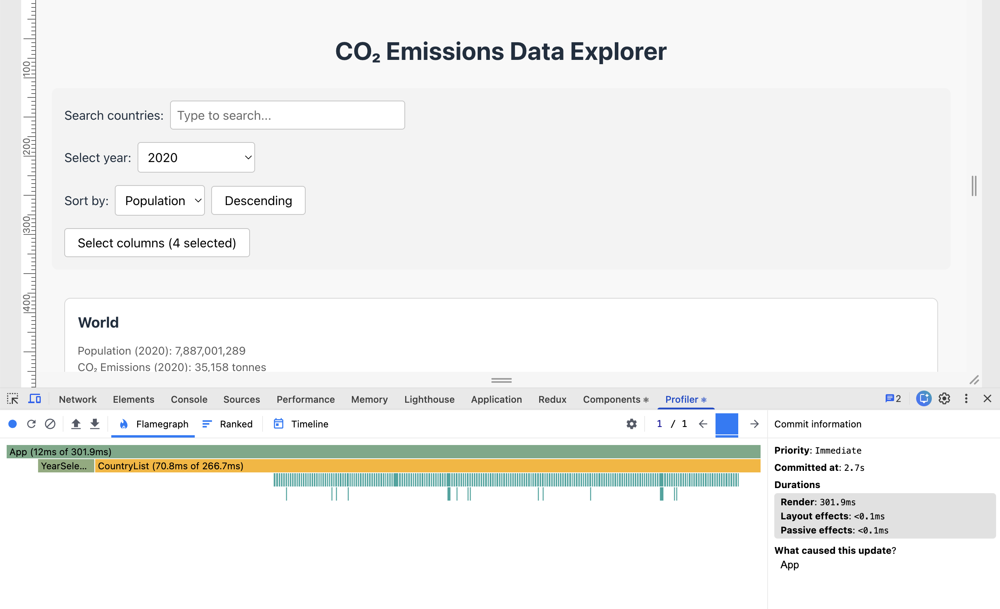
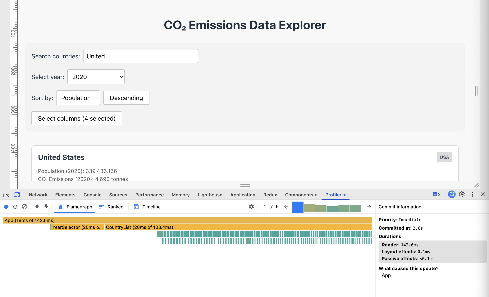
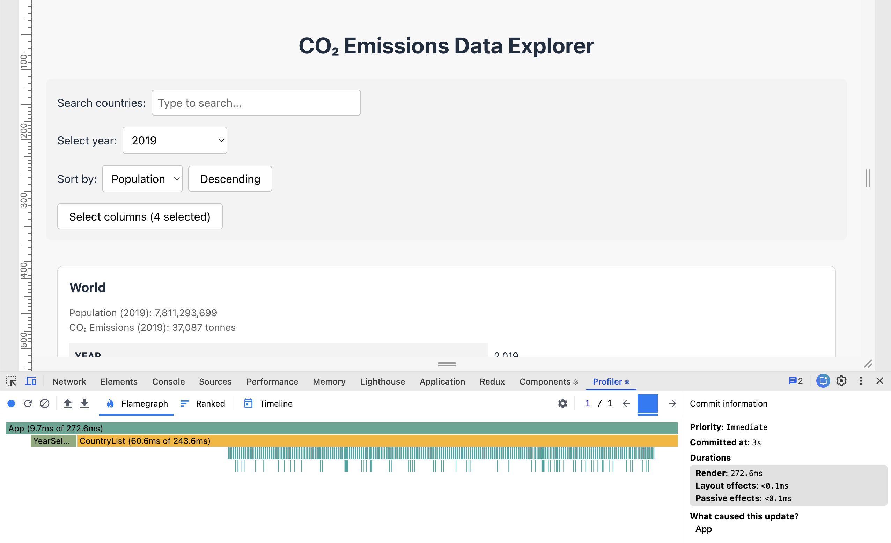
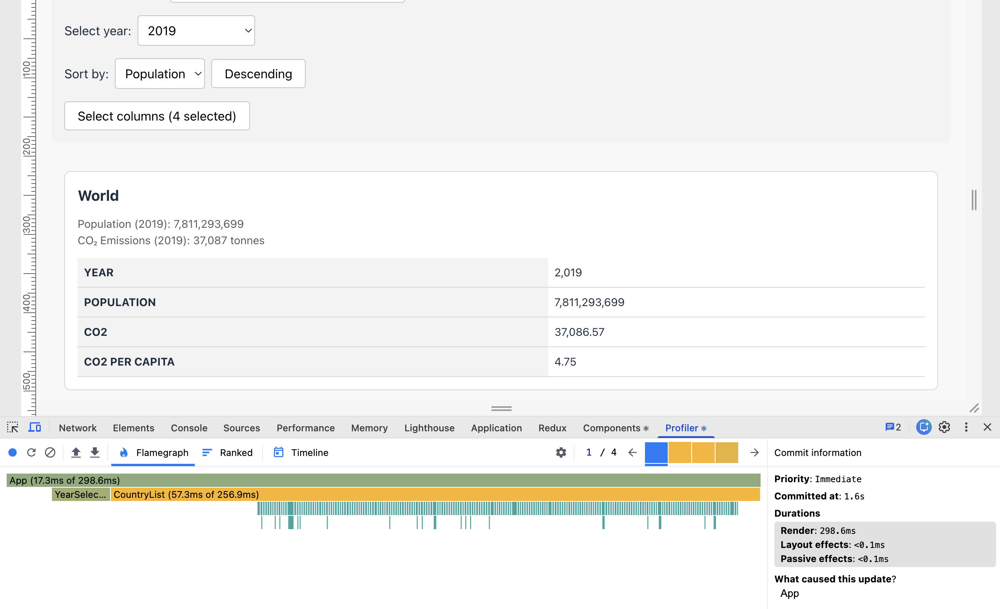

# Performance Optimization Report

## Baseline Measurements

### Interaction A: Sort countries

- **Commit duration**: N/A
- **Render duration**: 301.9 ms
- **Screenshot**: 

### Interaction B: Search countries

- **Commit duration**: N/A
- **Render duration**: 142.6 ms
- **Screenshot**: 

### Interaction C: Change year

- **Commit duration**: N/A
- **Render duration**: 272.6 ms
- **Screenshot**: 

### Interaction D: Toggle column

- **Commit duration**: N/A
- **Render duration**: 298.6 ms
- **Screenshot**: 