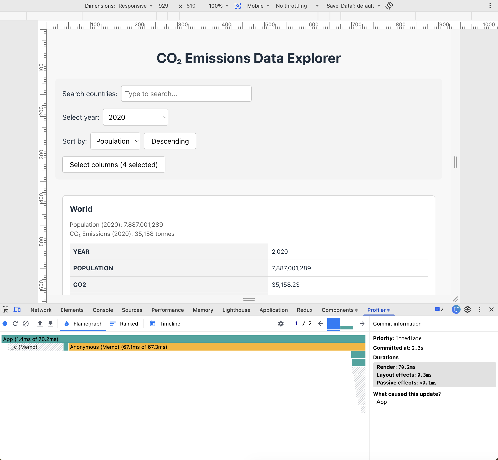
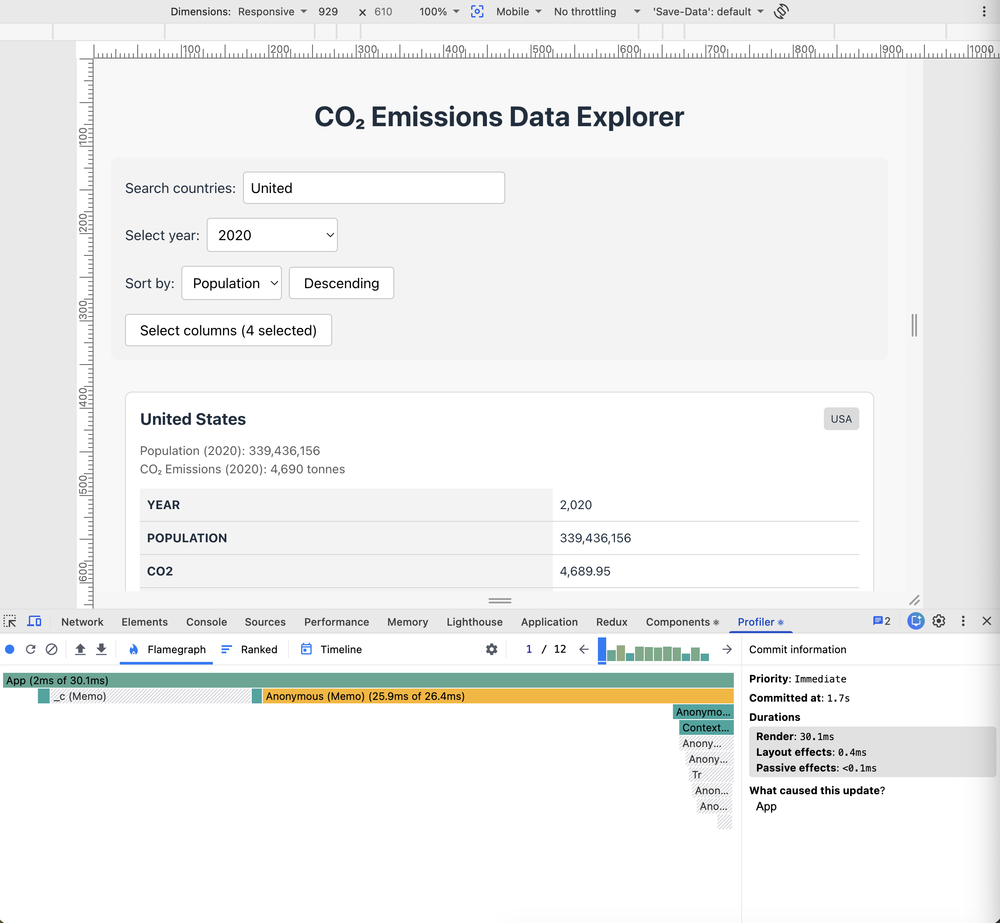
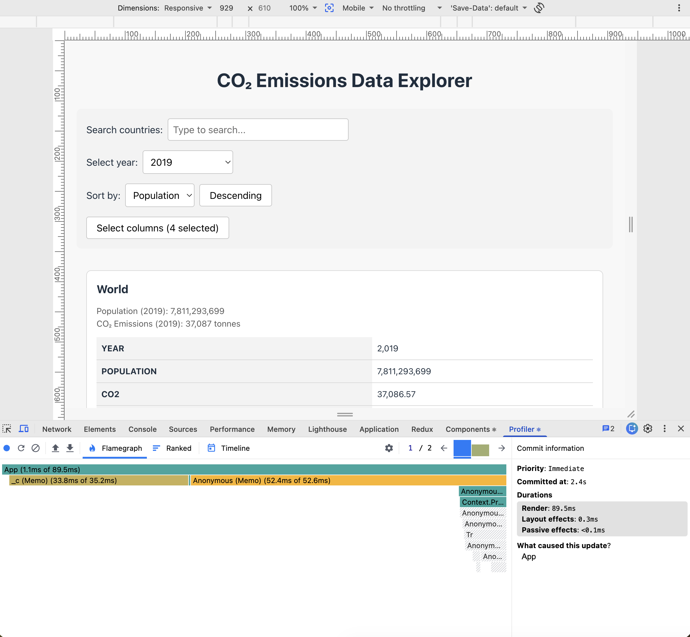
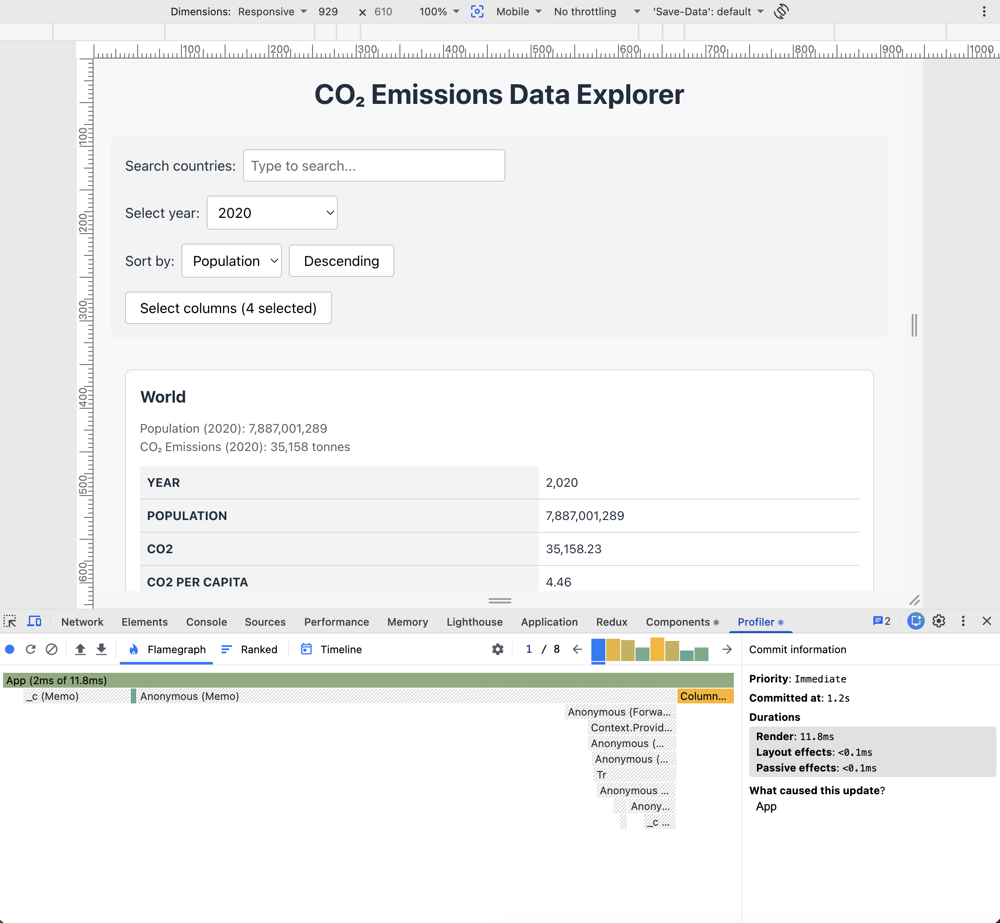

# Performance Optimization Report

## Baseline Measurements

### Interaction A: Sort countries

- **Commit duration**: N/A
- **Render duration**: 301.9 ms
- **Screenshot**: 

### Interaction B: Search countries

- **Commit duration**: N/A
- **Render duration**: 142.6 ms
- **Screenshot**: 

### Interaction C: Change year

- **Commit duration**: N/A
- **Render duration**: 272.6 ms
- **Screenshot**: 

### Interaction D: Toggle column

- **Commit duration**: N/A
- **Render duration**: 298.6 ms
- **Screenshot**: 

## Optimized Measurements

### Interaction A: Sort countries

- **Commit duration**: N/A
- **Render duration**: 70.2 ms
- **Screenshot**: 

### Interaction B: Search countries

- **Commit duration**: N/A
- **Render duration**: 30.1 ms
- **Screenshot**: 

### Interaction C: Change year

- **Commit duration**: N/A
- **Render duration**: 89.5 ms
- **Screenshot**: 

### Interaction D: Toggle column

- **Commit duration**: N/A
- **Render duration**: 11.8 ms
- **Screenshot**: 

## Summary of Improvements

| Interaction      | Baseline (ms) | Optimized (ms) | Improvement |
| ---------------- | ------------- | -------------- | ----------- |
| Sort countries   | 301.9         | 70.2           | 76.7%       |
| Search countries | 142.6         | 30.1           | 78.9%       |
| Change year      | 272.6         | 89.5           | 67.2%       |
| Toggle column    | 298.6         | 11.8           | 96.0%       |
| **Average**      | **253.9**     | **50.4**       | **80.2%**   |
